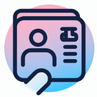
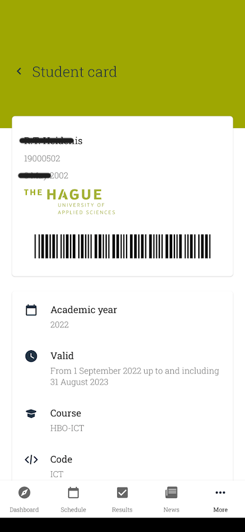
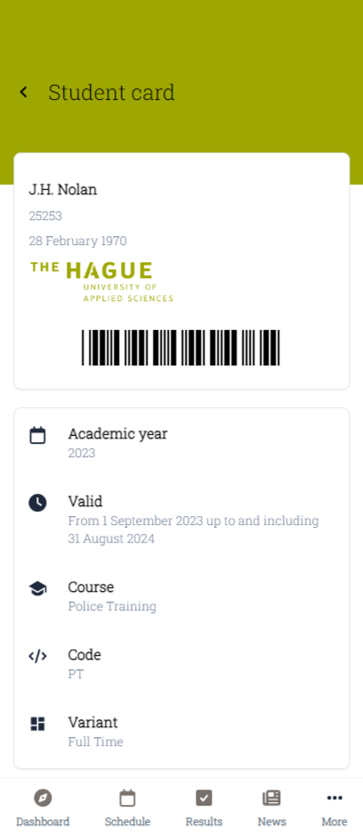
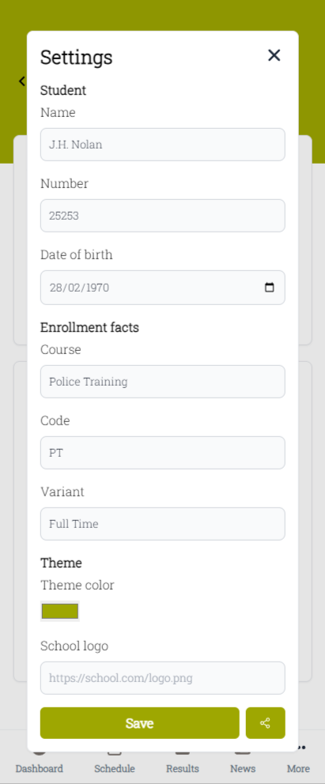
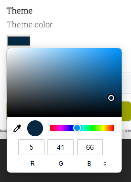
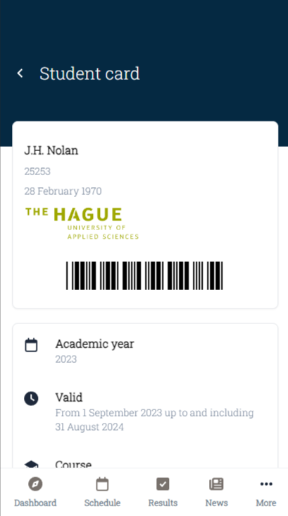
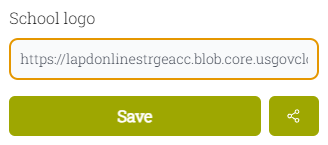
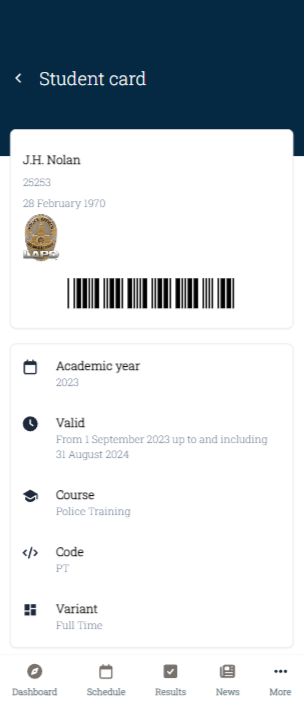

    
    <h1>Student Card</h1>
    
<i>Customizable THUAS like student card remake on the web</i>

    <h4>Get Student Card</h4>

<!-- TOC -->

    
Table of Contents

    <ol>
        <li>
          <a href="#features">Features</a>
        </li>
        <li>
          <a href="#technologies">Technologies</a>
          <ul>
            <li><a href="#language">Language</a></li>
            <li><a href="#styling">Styling</a></li>
            <li><a href="#hosted-on">Hosted on</a></li>
            <li><a href="#installable-as">Installable As</a></li>
          </ul>
        </li>
        <li>
          <a href="#screenshots">Screenshots</a>
          <ul>
            <li><a href="#student-card">Student Card</a></li>
            <li><a href="#settings">Settings</a></li>
            <li><a href="#theme">Theme</a></li>
            <li><a href="#school-logo">School logo</a></li>
          </ul>
        </li>
      </ol>

<!-- TOC -->

## About the project

Student Card is a remake of the THUAS (The Hague University of Applied Sciences) app. The app shows a student card, and
a settings modal that allows you to change all the information displayed, the theme color, and the school logo. It also
has a sharing feature, which allows you to share your student card with others.

I created it for <i>Educational Purposes Only</i>™, and to learn more about SolidJs and TailwindCSS. This was also an
opportunity to recreate an existing layout as well as possible, which I've accomplished quite well (if I do say so
myself).

## Features

✔️ Student card  
✔️ Customizable information  
✔️ Settings modal using Dialog  
✔️ Custom theming  
✔️ Shareable settings  

## Technologies

The project uses the following technologies:

#### Language:

#### Framework:

#### Styling:

  

#### Hosted on:

#### Installable as:

## Screenshots

### Original App

    
Collapse picture

This is the original MyTHUAS app, which was the main reference for this project.
I tried to find icons that looked as similar as possible to the original ones, but my icon library did not have all of them.

### Student Card

    
Collapse picture

The main page shows the student card and your enrollment facts. These can be customized in the settings modal,
accessible through the "more" button in the bottom navigation bar.

### Settings

    
Collapse picture

The settings modal allows you to change all the information displayed on the student card and enrollment facts. You can also change the
theme and the school logo. All the information is saved in local storage, so it will persist between sessions.

The share button opens the native share dialog, which allows you to share your student card with others. The shareable
link will contain all the information you've entered on the settings modal.

### Theme

    
Collapse picture

The theme can be changed in the settings modal. You can pick a custom color, which will be used by the app as the background color.

    
Collapse picture

### School logo

    
Collapse picture

The school logo can be changed in the settings modal. You can fill in a URL to an image, which will be used by the app as the school logo.

    
Collapse picture

